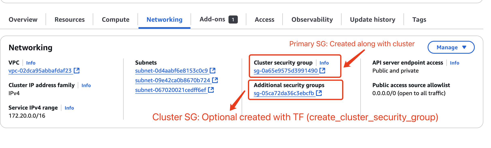
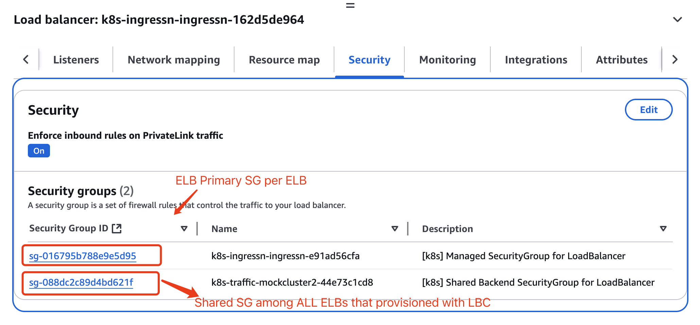

## Terraform EKS Module Security Group related Parameters Explained
### 1. `create_cluster_security_group`

**Purpose:** Controls whether to create a dedicated security group for the EKS cluster control plane. aka. the secondary security group

**Default:** `true`

**Behavior:**
When `true`, creates a security group named `eks-cluster-sg-<cluster-name>-<uniqueID>`
This security group is attached to the EKS control plane's network interfaces
Contains default rules allowing all traffic between cluster and nodes, and all outbound traffic
Also has self-referencing inbound rules

```
  create_cluster_security_group        = true # default is true
  cluster_security_group_additional_rules = {
    ingress_self_all = {
      description = "Inbound allow all ports/protocols from self"
      protocol    = "-1"
      from_port   = 0
      to_port     = 0
      type        = "ingress"
      self        = true
    }
  }
```
For `cluster_security_group_additional_rules`, set `source_node_security_group = true` inside rules to set the `node_security_group` as source

**Note:** Every time update a rule, the LBC policy would be updated. Nothing else updated, just refresh.


### 2. `create_node_security_group`

**Purpose:** Controls whether to create a dedicated security group for worker nodes

**Default:** `true`

**Behavior:**
When `true`, creates a separate security group for worker nodes
Contains rules allowing communication between nodes and the cluster control plane
Applied automatically to any managed node groups created by the module
Includes recommended security rules for Kubernetes networking

```
  create_node_security_group = false
  node_security_group_additional_rules = {
    ingress_self_all = {
      description = "Node to node all ports/protocols"
      protocol    = "-1"
      from_port   = 0
      to_port     = 0
      type        = "ingress"
      self        = true
    }
  }
  
```
For `node_security_group_additional_rules`, can set `source_cluster_security_group = true` inside rules to set the `cluster_security_group` as source.

### 3. `attach_cluster_primary_security_group`
**Purpose:** Controls whether to attach the cluster's primary security group to worker nodes

**Default:** Varies by module version

**Behavior:**
When `true`, attaches the cluster's primary security group to each node in addition to the node security group
The primary security group is the one created by EKS itself, which allows all communication between cluster components
Provides a simpler security model with broader access between components
When set to true in node group defaults, applies to all managed node groups


## Important Considerations
1. Dependency Relationship:
By setting `create_cluster_security_group = false` while keeping `create_node_security_group = true` can cause failures because the node security group rules depend on the cluster security group existing.
2. Security Implications:
`attach_cluster_primary_security_group = true` provides broader access but less granular control over security
The cluster's primary security group allows all traffic between components, which is simpler but less secure
3. Recommended Configuration: 
If you need custom security rules, keep both security groups but customize them. 
If you want to use your own security groups, set both create parameters to false and specify your own.


## Security Groups involved.

**Cluster Securitry Groups**

**ELB Security Groups**



| Security Groups       | Description                                                                 | Naming Pattern                             |
|-----------------------|-----------------------------------------------------------------------------|-------------------------------------------|
| Cluster Primary SG    | The security group is automatically created along with the cluster itself, outside of the Terraform scope. Only this SG is tagged with `kubernetes.io/cluster/<cluster_name>`| `eks-cluster-sg-<cluster-name>-<uniqueID>` |
| Cluster SG            | Optional. The security group is created with Terraform EKS module via the `create_cluster_security_group` | `<cluster-name>-cluster-<uniqueID>`      |
| Node Additioanl SG | Optional. Can be created with `create_node_security_group` | `<cluster-name>-node-<uniqueID>` |
| ELB Primary SG | Created along with the ELB. | `k8s-` |
| ELB Shared SG | Shared among all ELBs that provisioned with LBC | `k8s-traffic-` |
